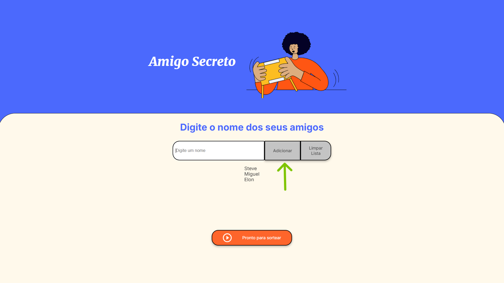
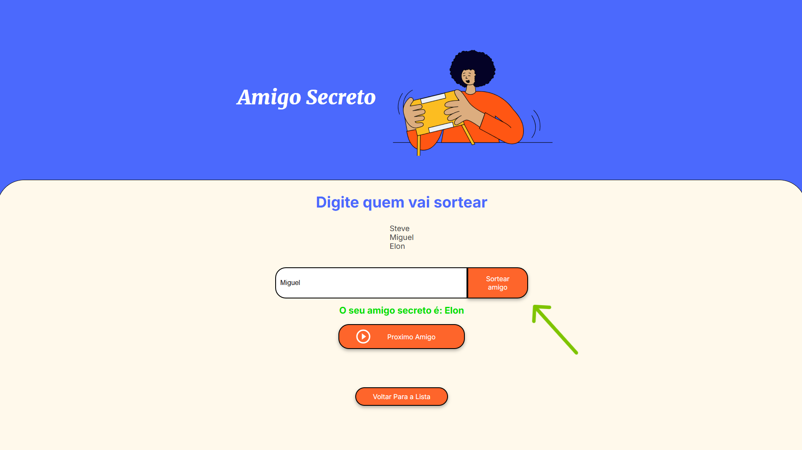

<h1 align="center">Amigo Secreto</h1>

<h3>Sobre:</h3>

 Amigo Secreto é um projeto do desafio de frontend da turma 8 do ONE(Oracle Next Education) realizado pela Alura, desenvolvido para organizar de forma simples e divertida a tradicional brincadeira de troca de presentes. Este aplicativo permite que os participantes se inscrevam, realizem o sorteio e descubram quem é seu amigo secreto de maneira intuitiva e fácil de usar.

<h3>Funcionalidades:</h3>

* **Adicionar nomes**: Os participantes inserem seus nomes em um campo de texto e clicam no botão "Adicionar" para adicioná-los a uma lista visível na tela.

* **Limpar lista**: Um botão permite limpar toda a lista de nomes adicionados.

* **Lista terminada**: Ao clicar em "Pronto para sortear", o usuário é levado para outra página com o mesmo layout.

* **Realizar o sorteio**: Agora chegou a hora de realizar o sorteio do seu amigo. Insira o nome de alguem da lista e clique em "Sortear Amigo".

* **Próximo amigo**: Após o sorteio, um botão "Próximo amigo" permite limpar a tela para que o próximo participante possa realizar seu sorteio sem interferências.

<h3>Importante:</h3>
Algumas mensagens de alerta vão aparecer caso:

* Tente colocar um nome em branco.
* O nome inserido não esteja na lista.
* O nome já tenha realizado o sorteio.
* Quando todos ja tiverem realizado o sorteio.

<h3 align="left">Conecte-se comigo:</h3>

<h3 align="left">Ferramentas utilizadas:</h3>

     

### Contribuições:
Quem quiser contribuir com o projeto ou opiniões estou a disposição.
